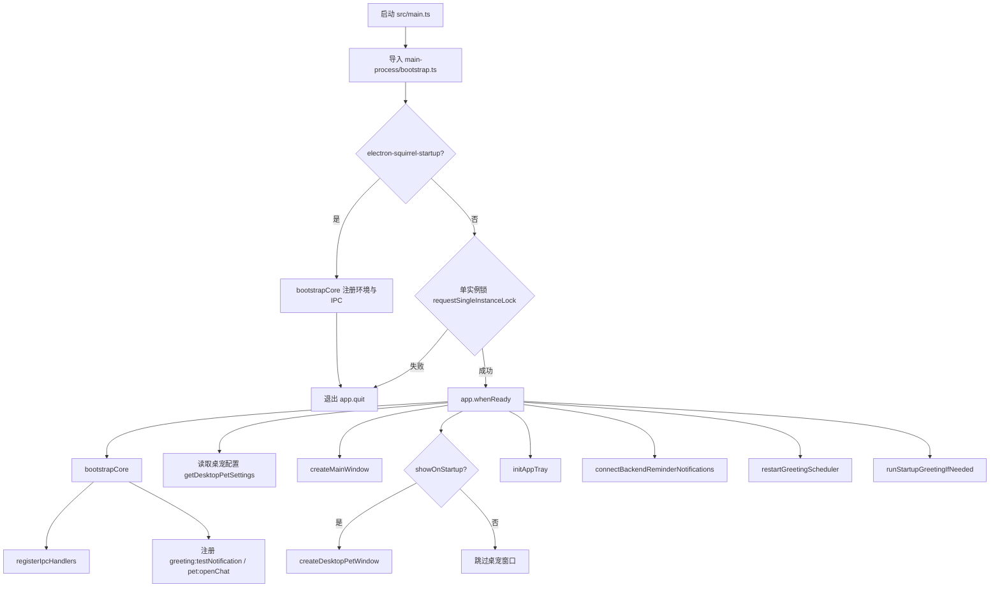
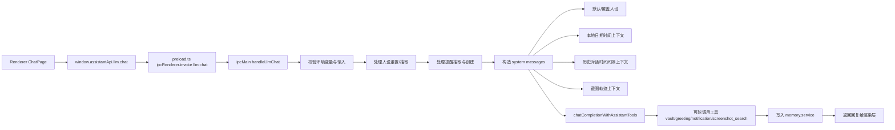
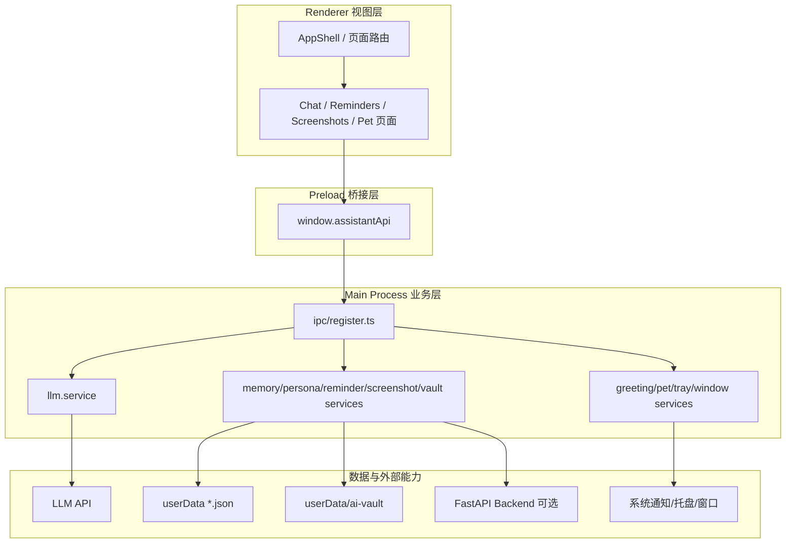

# 项目流程图

以下流程图基于当前代码主链路整理，使用 Mermaid 语法，可在支持 Mermaid 的编辑器中直接渲染。

## 1) 应用启动流程（Electron 主链路）

```mermaid
flowchart TD
    A[启动 src/main.ts] --> B[导入 main-process/bootstrap.ts]
    B --> C{electron-squirrel-startup?}
    C -- 是 --> D[bootstrapCore 注册环境与IPC]
    D --> E[退出 app.quit]
    C -- 否 --> F{单实例锁 requestSingleInstanceLock}
    F -- 失败 --> E
    F -- 成功 --> G[app.whenReady]
    G --> H[bootstrapCore]
    H --> I[registerIpcHandlers]
    H --> J[注册 greeting:testNotification / pet:openChat]
    G --> K[读取桌宠配置 getDesktopPetSettings]
    G --> L[createMainWindow]
    G --> M{showOnStartup?}
    M -- 是 --> N[createDesktopPetWindow]
    M -- 否 --> O[跳过桌宠窗口]
    G --> P[initAppTray]
    G --> Q[connectBackendReminderNotifications]
    G --> R[restartGreetingScheduler]
    G --> S[runStartupGreetingIfNeeded]
```

## 2) 渲染层调用主进程流程（以对话为例）

```mermaid
flowchart LR
    A[Renderer ChatPage] --> B[window.assistantApi.llm.chat]
    B --> C[preload.ts ipcRenderer.invoke llm:chat]
    C --> D[ipcMain handleLlmChat]
    D --> E[校验环境变量与输入]
    E --> F[处理人设重置/抽取]
    F --> G[处理提醒抽取与创建]
    G --> H[构造 system messages]
    H --> H1[默认/覆盖人设]
    H --> H2[本地日期时间上下文]
    H --> H3[历史对话时间间隔上下文]
    H --> H4[截图轨迹上下文]
    H --> I[chatCompletionWithAssistantTools]
    I --> J[可能调用工具 vault/greeting/notification/screenshot_search]
    J --> K[写入 memory.service]
    K --> L[返回回复给渲染层]
```

## 3) 模块分层关系图

```mermaid
flowchart TB
    subgraph R[Renderer 视图层]
      R1[AppShell / 页面路由]
      R2[Chat / Reminders / Screenshots / Pet 页面]
    end

    subgraph P[Preload 桥接层]
      P1[window.assistantApi]
    end

    subgraph M[Main Process 业务层]
      M1[ipc/register.ts]
      M2[llm.service]
      M3[memory/persona/reminder/screenshot/vault services]
      M4[greeting/pet/tray/window services]
    end

    subgraph D[数据与外部能力]
      D1[userData *.json]
      D2[userData/ai-vault]
      D3[LLM API]
      D4[FastAPI Backend 可选]
      D5[系统通知/托盘/窗口]
    end

    R1 --> R2 --> P1 --> M1
    M1 --> M2
    M1 --> M3
    M1 --> M4
    M2 --> D3
    M3 --> D1
    M3 --> D2
    M3 --> D4
    M4 --> D5
```

